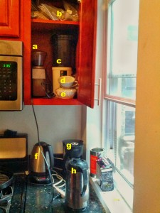

Coffee's been a pivotal component in my life, so it doesn't surprise me it's playing a starring role in my sleep experiment (see [here](/coercing-a-sleep-schedule/ "Coercing a Sleep Schedule") and [here](/coercing-a-sleep-schedule-contd-part-deux/ "Coercing a Sleep Schedule (cont’d, part deux)") if you don't know what I'm talking about.) I'm happy to report that the experiment is continuing to run without any additional problems. I'm still managing to get in a 30-minute work-out each morning. This week (meaning Sunday, Monday, Tuesday and Wednesday nights) has seen me going to sleep somewhere between 2 and 3 AM and waking up somewhere between 9 and 10 AM. Staying up until 4 now seems like a heroic task, based on how bed-ready I feel in that 2 o'clock hour. Next week will mark a full month, so I'll save the in-depth analysis for then.

Today, I want to invite you all to the unincorporated borough of my kitchen I'll call Coffeelandia:

*   **a**: My trusty Solis Maestro grinder. I purchased it in 2005 _used, _and it has continued to crank out the hits for almost 10 years now. It's been already a long time that Solis sold the line to a company called Baratza. which sells a modified version of it as the Encore. All I can say is that the longevity should justify the price tag.
*   **b**: Green (unroasted) coffee storage. At home I brew exclusively coffee I've roasted myself, generally within the last couple of days. It's a rewarding hobby that has truly hobbled me with an obsession over coffee freshness. It's a shame that even in some of NYC's more fanciful roasted coffee purveyors, you'll find beans stamped with roast dates over two weeks old, or even worse--_not dated_. The magic of green coffee is that it has a shelf-life of about one year. So I order 20-25 lbs from [www.sweetmarias.com](http://www.sweetmarias.com "Sweet Maria"), which takes me about half a year to burn through. Wash rinse repeat.
*   **c**: The Coffee Roasters, stacked. If these remind you of plug-in popcorn poppers, that's because they are. The one on top was found in a thrift store in Iowa immediately following the breakdown of an older (and still missed) popper/roaster, the one underneath is a recent find from a Brooklyn thrift store. Just one of these is truly all you need to roast your own coffee, but hear this caveat: not all popcorn poppers are created equal. First, you need one where the hot air is fed in through vents along the sides of the cylindrical chamber--another type, wherein the hot air flows in through a grate located at the bottom of the chamber will do nothing but light your coffee on fire (I'm told). And among the correct type, the ones that are going to work will be from the 80's/90's, be of a characteristically sturdier build quality than the cheap crap put out nowadays and will draw at least 1200W from your power source (check the embossed electrical info on the bottom of the unit).
*   **d**: Hario conical drip brewer. This, in conjunction with hot water supplied from **f.**, flowing through the filters in the box you see on the windowsill and ultimately dripping into **h.** is how I used to brew all my coffee at home. It's a more manual approach which I still enjoy on the weekends, or when I need just one more cup.
*   **e:** Is this getting tedious? These are the filter baskets for my insta-coffee-robot. Why did I tag these? I don't know.
*   **f:** This is an electric kettle, Hamilton Beach branded, costing ~$35 on Amazon (see **d.**). I highly recommend at that price. It doesn't have the temperature stability of higher-end kettles, but at least it allows you heat the water to between 175 and boiling, and does an OK job of keeping it there.
*   **g:** There's my coffee robot, with an adorable coffee-related sticker affixed, courtesy of a Hacker School pal who works at [Perka](http://perka.com "Perka").
*   **h:** Zojirushi thermos. If you're making more than will be consumed instantly, this is a must-have. Glass-lined to avoid imparting a metallic taste, and will keep coffee hot for 2 hours, warm for up to 6, roughly. I instruct coffee robot to make me two cup's worth each morning, and the second cup hangs out in here until it's time comes.

Whew! That was fun, wasn't it?

So maybe you're thinking "wait, hold on a second. I'm still getting this concept of home roasting into my skull. Like... where do you roast it?" Good question. Right on the outside ledge of that window. As coffee roasts, the "chaff"--a thin outer layer of the bean--turns into a flaky dried shell, detaches and goes airborne thanks to the air flowing upward from the popcorn popper. Hence, this style of roasting is not recommended for doing inside. If you look closely you'll see a little bit of it littering the counter... some of it manages to get through the window screen.

Wow, you've read all of this? Well, as a reward I'll roast some coffee fresh just for you! Be among the first 5 to ask (either on facebook, or inbox me: g -dot- s -dot- altman -at- gmail -dot- com and some coffee will be coming your way.
