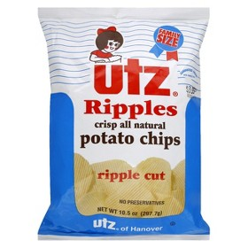
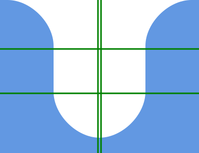

I've got a new URL, at least temporarily. Free hosting on Github is neat, and easy to set-up thanks to [jekyll-now](https://github.com/barryclark/jekyll-now). By default, it gives you a very basic look to your blog. But, of course, I wanted to keep my Utz-inspired theme which I'd built in Wordpress.



Warning: It's going to get a bit nerdy from here.

The old way that I achieved this effect was by a real ugly hack. It relied on a three-column div layout--so that the blue border you see to the left and right were actual block elements, with the background color set, and with either the top-right or top-left corner set to have a border-radius.

Now, this is bad for many reasons, but perhaps most because it violates the intended purpose of HTML: to provide a semantic structure to content. Kind of like declaring "This is the header, this is the main portion, this is a blog post within the main portion, this is the footer, etc". HTML's friend CSS comes in to provide the style to all those elements.


I realized that what I essentially wanted was a custom border to the "main" section of the page (i.e., the one holding the text you're reading now). Enough queries Google eventually led me to find [the border-image property](https://developer.mozilla.org/en-US/docs/Web/CSS/border-image). It's a tremendously powerful alternative to the typical border css you might know and love. I'll try my best to explain.

Here is the actual border that you see around this text right now.


It's an SVG which the browser is slicing up into a 3x3 grid. The CSS looks like this:

```
#main {
	border-image-source: url(http://fewf.github.io/images/utz-border-image.svg);
	border-image-slice: 32 64 39;
	border-image-repeat: stretch;
    border-width: 4em 7em;	
}
```

It gives the browser the image and says slice it thiswise:

* One horizontal slice 32 pixels from the top.
* One horizontal slice 39 pixels from the bottom.
* Two vertical slices, one 64 pixels in from the right, the other 64 pixels in from the left.

For a final project that would look thusly:



We now have our 3x3 grid. Let's use directions to refer to the gridded off chunks; we've got a N S E and W chunks, as well as NW, NE, SE and SW chunks. Lastly, the very center of this grid is the thing to be bordered (once again, the text you're reading now).

Now, with this information, the browser knows to stretch what it finds in the East and West chunks as the bordered content grows in length, and likewise to use what's in North and South to stretch for the horizontal content. (If `border-image-repeat` is set to `repeat`, it will repeat instead of stretch. For this usage, the effect is identical.) The imagery inside the NW, NE, SE and SW chunks will sit unaffected by the length or width of the content at the corners of the borders.

However, they and the whole image are scaled by the `border-width` property, stretching the SVG beyond its default dimensions. Careful to notice that the "slicing" is done to the SVG with its own defined dimensions, not the actual dimension the image is stretched to on the screen.

Hope this makes sense--and keep snacking!